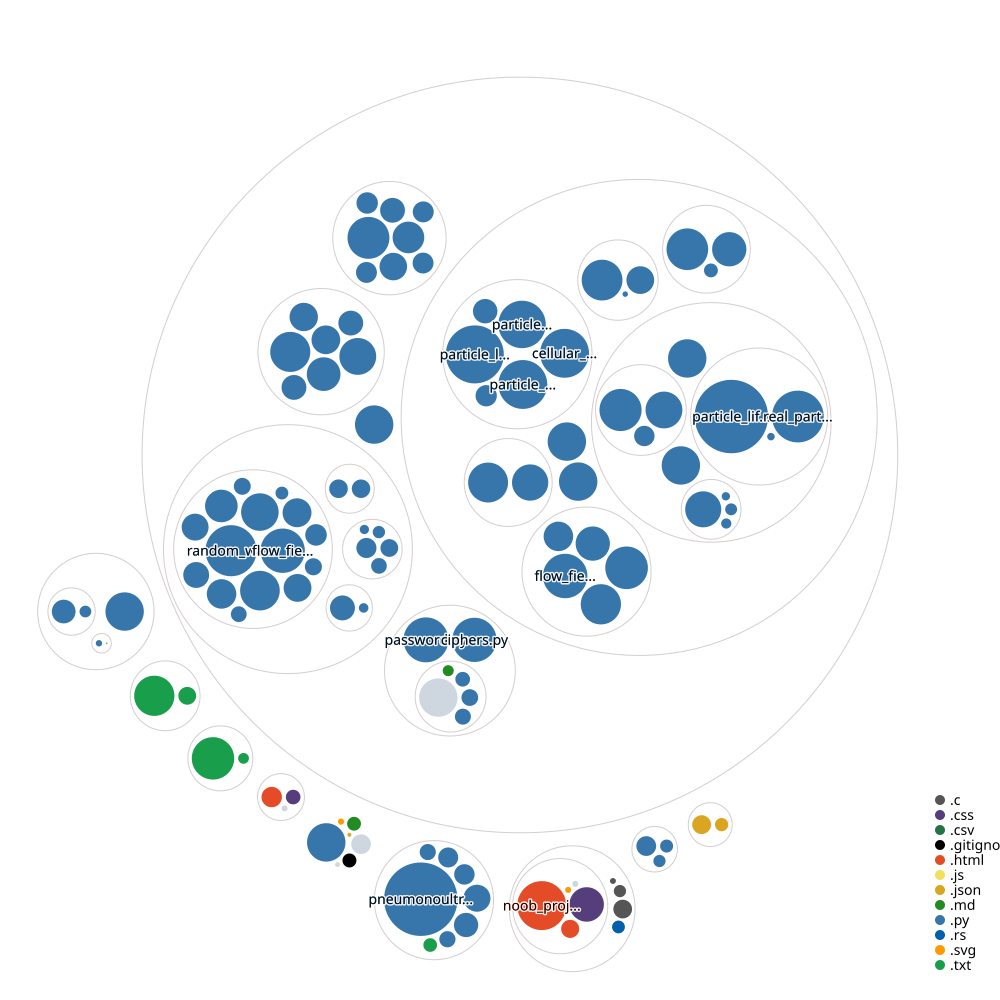

# Python Projects

These projects are  made purely (~95%) from Python

## Repository Map

## Why This Repo?

I created it to explore different paths in Python development:

- Machine learning
- Data handling  
- Web development  
- And even in other languages  

Basically, it’s my personal lab for learning and experimenting.  

## Future

this repo exists bcs i want to imporove my resume for college and my future jobs

## AIM

do consistent commits to overthrow ai and become the next me
